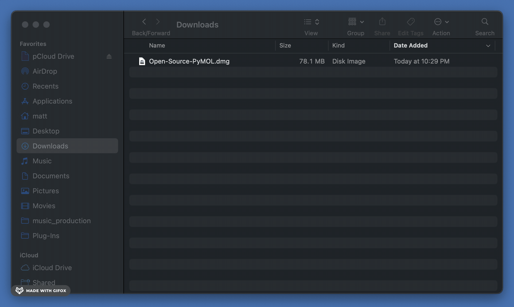

# Installation for macOS

## Step-by-Step Installation Guide
For a convenient and user-friendly installation follow these steps 
(installation should take around **1 minute**):

### Step 1 - Download .dmg
Download Open-Source PyMOL by clicking [here](https://github.com/kullik01/pymol-open-source-setup/releases). 
The download will start automatically and will take around a minute to download depending on your internet connection.

### Step 2 - Navigate to the Downloads folder
After the download finished open a Finder window and navigate to _Downloads_.

### Step 3 - Install
Double-click on the file **.dmg** and then drag the Open-Source PyMOL icon on the _Applications_ folder:

