# Installation for Windows Operating System
This page will present a comprehensive in-depth explanation of the installation procedure.
The PySSA installation package is approximately **10 GB** in size, taking **several minutes to download** depending on your internet speed.
The entire installation process of all three components (WSL2, ColabFold and PySSA), should take around **20 minutes**
(with a **hands-on time** of around **5 minutes**) and may require a **restart of the computer**.

## Prerequisites
You must be running Windows 10 version 2004 and higher (Build 19041 and higher) or Windows 11 to use PySSA.

## Download and extract setup

1. Download the _PySSA_1.0.6_Setup.zip_. Click [here](<insert correct link here!>)
   to automatically start the download. The download will take several minutes to download depending on your internet connection.

2. After the download finished open a Windows explorer window and navigate to _Downloads_.

3. Extract the downloaded ZIP file by clicking on the **Extract All ...** button.
    <figure markdown="span">
      { width="1000" }
      <figcaption></figcaption>
    </figure>

4. Click on **Extract** to confirm the start of the extraction process.
    <figure markdown="span">
      { width="1000" }
      <figcaption></figcaption>
    </figure>

   A dialog window will open that displays the extraction progress.
    <figure markdown="span">
      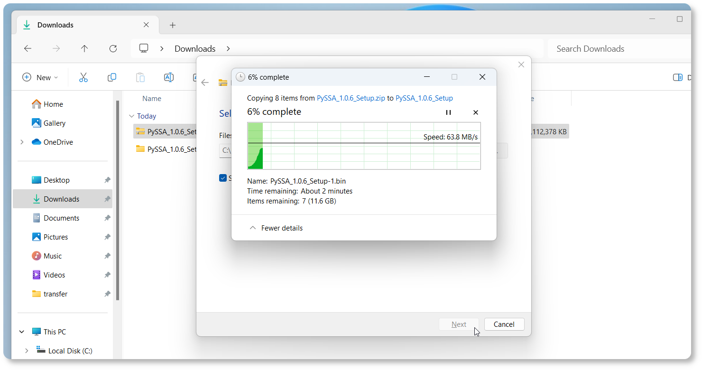{ width="1000" }
      <figcaption></figcaption>
    </figure>

## Run setup
1. After the extraction process finished, a new Windows explorer windows will open.
   In the new window double-click on the file **PySSA_1.0.6._Setup.exe** to start the setup.
    <figure markdown="span">
      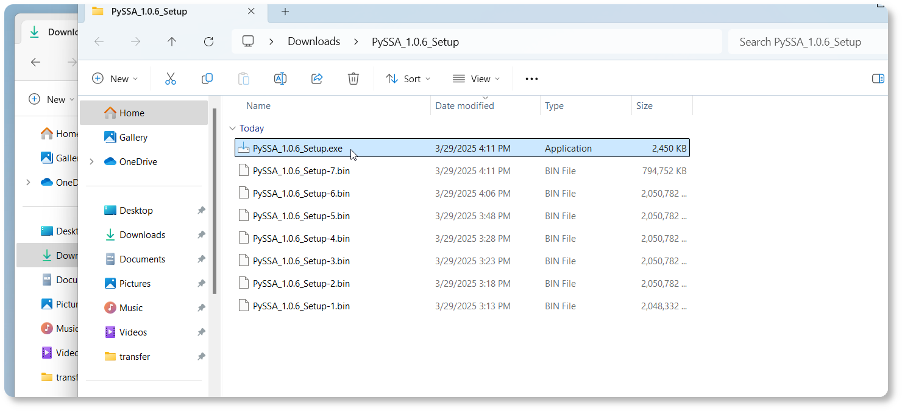{ width="1000" }
      <figcaption></figcaption>
    </figure>

2. Depending on the security settings a _Windows protected your PC_ dialog will open.
   Click on **More info** to proceed.
    <figure markdown="span">
      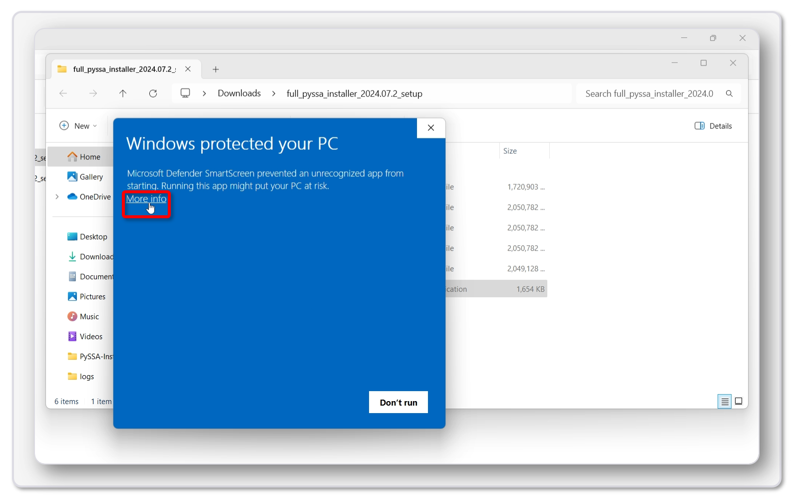{ width="1000" }
      <figcaption></figcaption>
    </figure>

3. Click on **Run anyway** to start the setup.
    <figure markdown="span">
      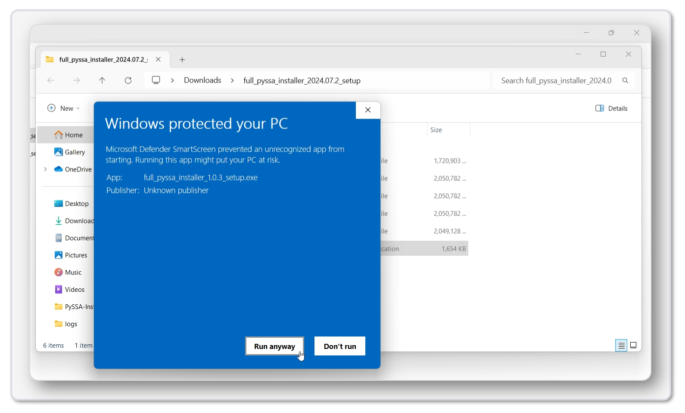{ width="1000" }
      <figcaption></figcaption>
    </figure>

4. The _PySSA Setup Wizard_ will open. Click on **Next** to proceed.
    <figure markdown="span">
      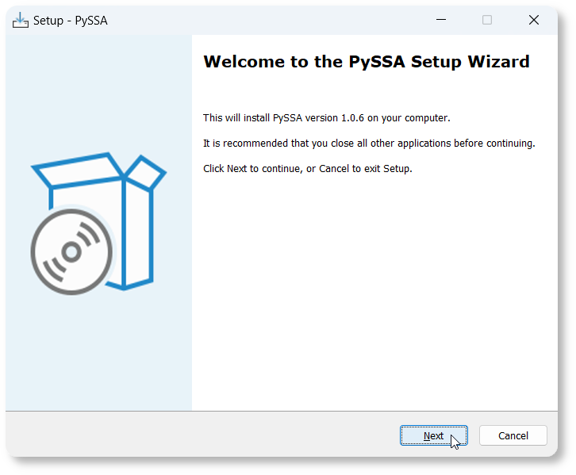{ width="600" }
      <figcaption></figcaption>
    </figure>

5. Agree to the license agreement and click on **Next**.
   

        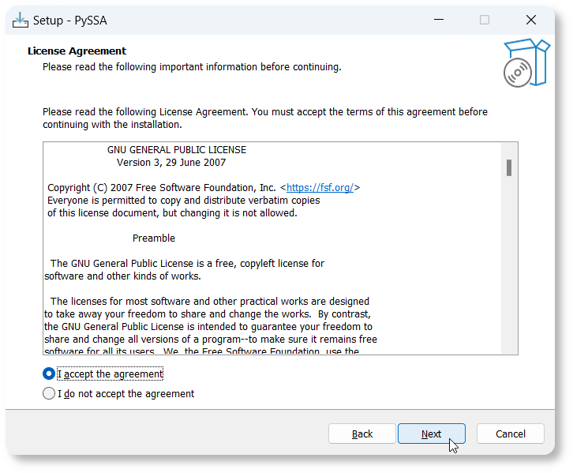
   

6. The setup checks if all prerequisites are installed. Wait until the check is finished.
    <figure markdown="span">
      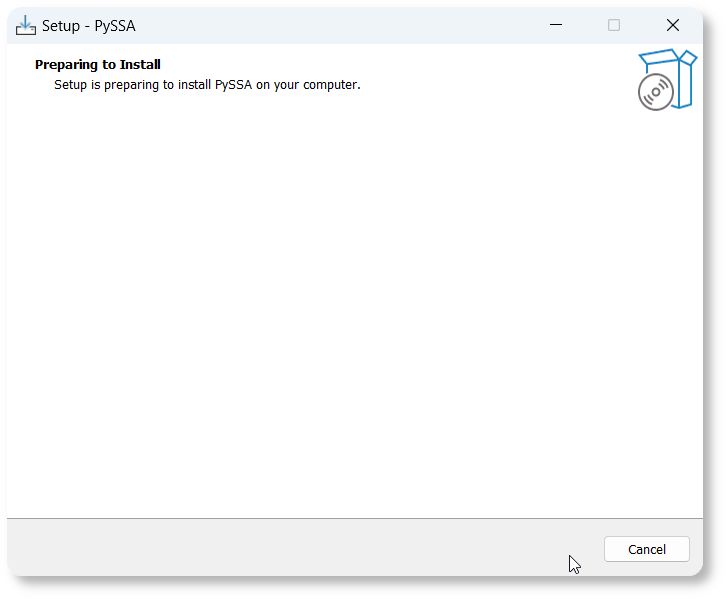{ width="600" }
      <figcaption></figcaption>
    </figure>

### WSL2
1. If the WSL2 is **not** installed, the setup will give the opportunity to install it. Click on **Yes** to proceed.
    <figure markdown="span">
      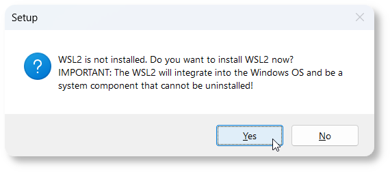{ width="500" }
      <figcaption></figcaption>
    </figure>

2. The setup will ask to restart the computer. Select _Yes, restart the computer now_ and click on **Finish**.
    <figure markdown="span">
      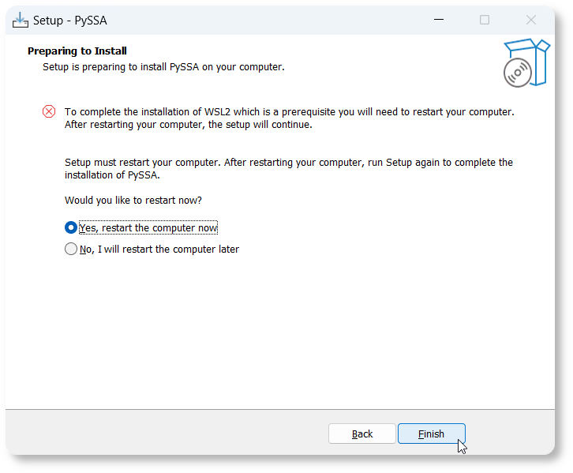{ width="600" }
      <figcaption></figcaption>
    </figure>

3. After the computer restarted, the setup will open automatically. Click on **Install** to start the installation process.
    <figure markdown="span">
      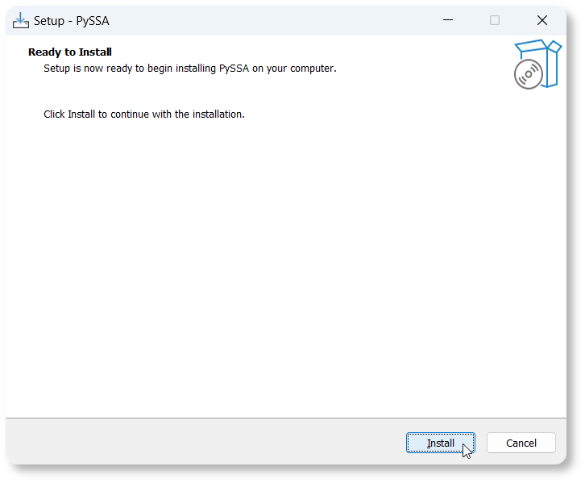{ width="600" }
      <figcaption></figcaption>
    </figure>    

### Installing
1. Wait for the installation to finish (This step takes around **10 minutes** to complete).
    <figure markdown="span">
      { width="600" }
      <figcaption></figcaption>
    </figure>  

2. Wait until the post-installation steps are finished. The setup will **automatically** close the installation window.
    <figure markdown="span">
      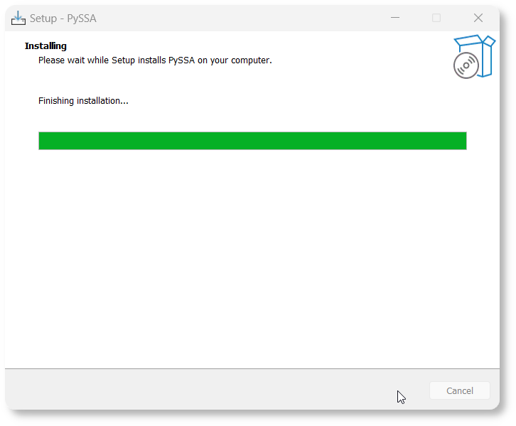{ width="600" }
      <figcaption></figcaption>
    </figure>  

## Start PySSA
1. To start PySSA, double-click on the provided desktop icon.
    <figure markdown="span">
      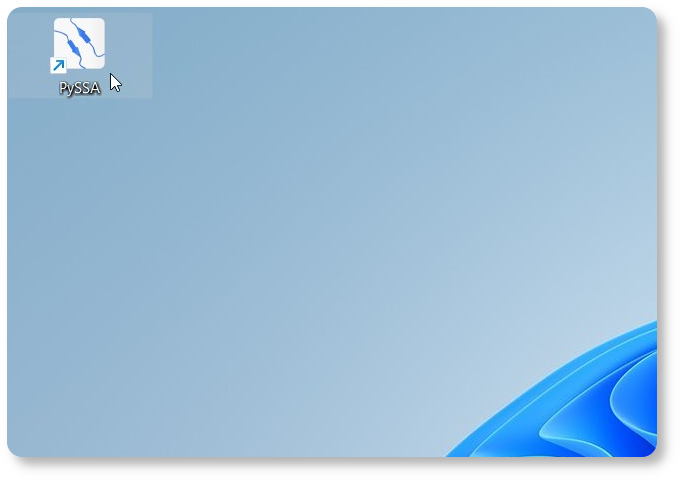{ width="600" }
      <figcaption></figcaption>
    </figure>  

2. PySSA and PyMOL will be launched, and their windows will be arranged automatically.
    <figure markdown="span">
      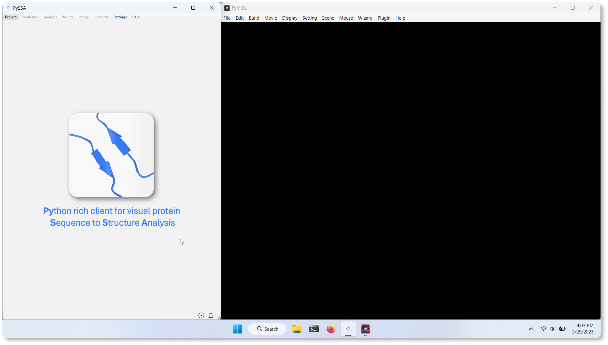{ width="1000" }
      <figcaption></figcaption>
    </figure>  
