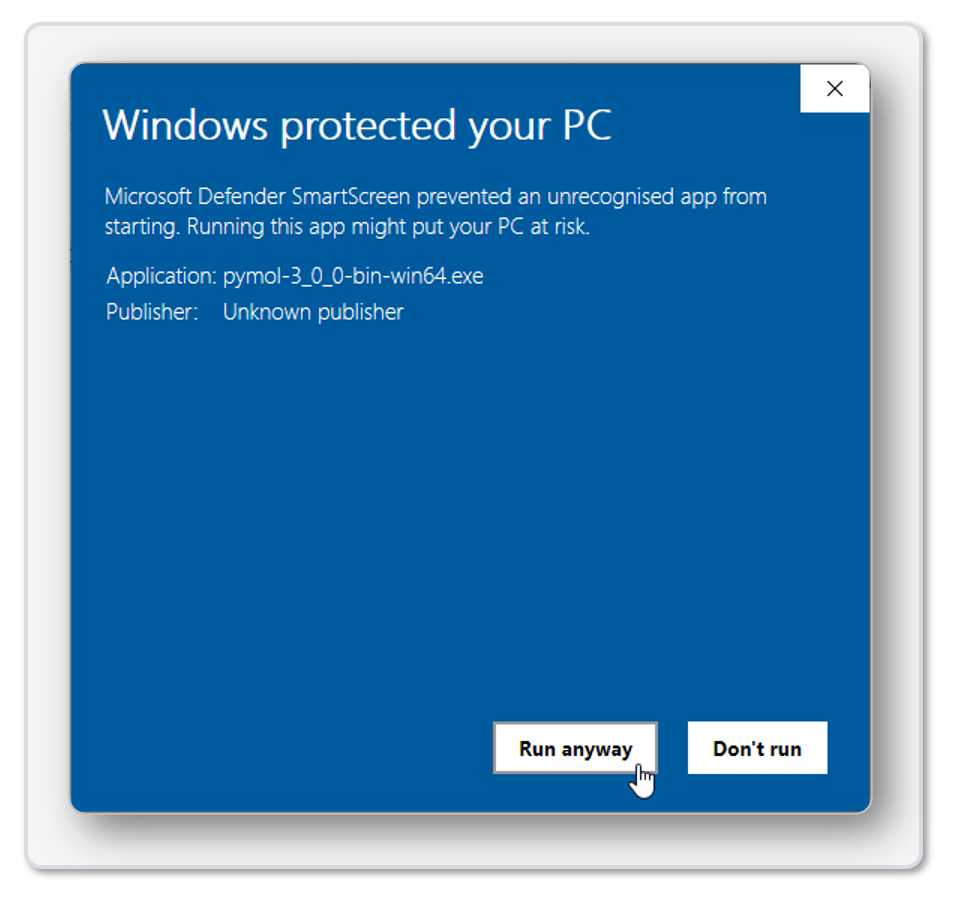

# Installation for Windows Operating System
Install location: `C:\Users\%USERNAME%\AppData\Roaming\PyMOL-Open-Source\bin`

## Step-by-Step Installation Guide
For a convenient and user-friendly installation follow these steps (installation should take around **5 minutes**):

1. Download the _PyMOL_Open_source_v3.1.0a0_WINx64_setup.exe_. Click [here](https://github.com/kullik01/PyMOL-open-source-setup/releases) to automatically start the download. The download will take around a minute to download depending on your internet connection.

2. After the download finished open a Windows explorer window and navigate to _Downloads_.

3. Double-click on the file **PyMOL_Open_source_v3.1.0a0_WINx64_setup.exe** to start the setup.
    

      
    

4. Depending on the security settings a Windows protected your PC dialog will open. Click on **More info** to proceed.
    

      
    

5. Click on **Run anyway** to start the setup.
    

      
    

6. Agree to the license agreement and click on **Next**.
    

      
    

7. Wait for the installation to finish (This step takes around **1 minute** to complete).
    

      
    

8. Click on **Finish**.
    

      
    

9. Start PyMOL by double-clicking on the desktop icon.
    

      
    

    
    

      
    

